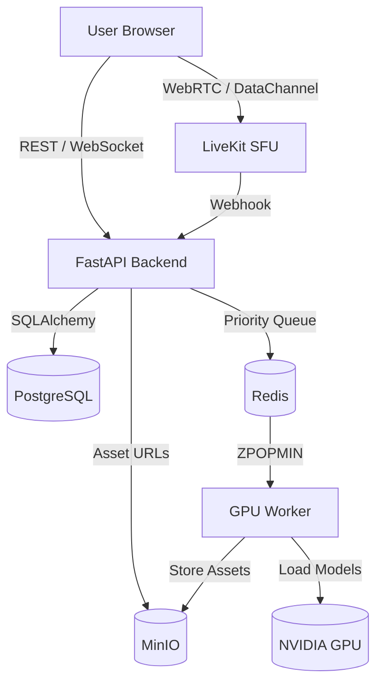
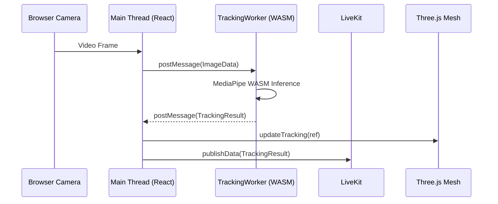

# Architecture Diagrams

## 1. System Architecture

```mermaid
flowchart TD
    User[User Browser] -->|WebRTC / DataChannel| LiveKit[LiveKit SFU]
    User -->|REST / WebSocket| FastAPI[FastAPI Backend]
    FastAPI -->|SQLAlchemy| Postgres[(PostgreSQL)]
    FastAPI -->|Priority Queue| Redis[(Redis)]
    FastAPI -->|Asset URLs| MinIO[(MinIO)]
    Redis -->|ZPOPMIN| GPUWorker[GPU Worker]
    GPUWorker -->|Store Assets| MinIO
    GPUWorker -->|Load Models| GPU[(NVIDIA GPU)]
    LiveKit -->|Webhook| FastAPI
```

## 2. Edge AI & Tracking Pipeline (M29)

```mermaid
sequenceDiagram
    participant Cam as Browser Camera
    participant Main as Main Thread (React)
    participant Worker as TrackingWorker (WASM)
    participant LiveKit
    participant Avatar as Three.js Mesh
    Cam->>Main: Video Frame
    Main->>Worker: postMessage(ImageData)
    Worker->>Worker: MediaPipe WASM Inference
    Worker-->>Main: postMessage(TrackingResult)
    Main->>Avatar: updateTracking(ref)
    Main->>LiveKit: publishData(TrackingResult)
```
